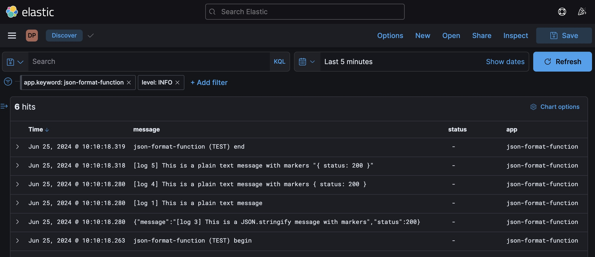
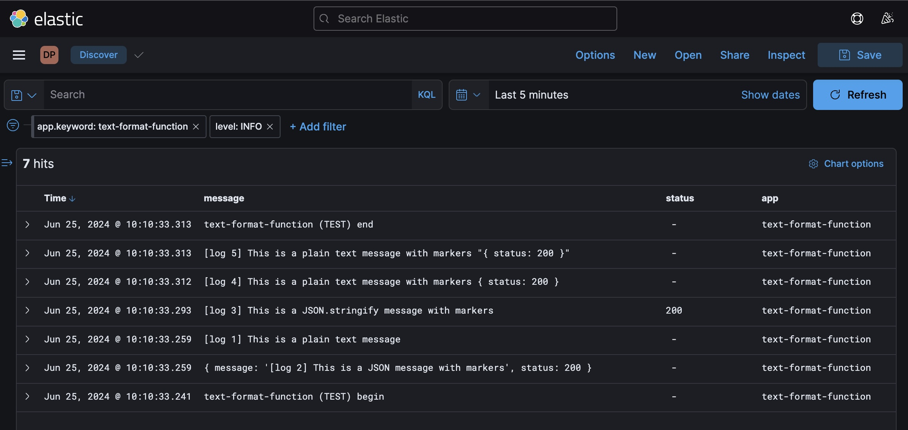

# AWS Lambda Log Format

An experiment to understand how different [AWS Lambda log formats](https://docs.aws.amazon.com/lambda/latest/dg/monitoring-cloudwatchlogs-advanced.html) 
are handled by [`guardian/cloudwatch-logs-management`](https://github.com/guardian/cloudwatch-logs-management).

The repository uses AWS CDK to provision two Lambda functions. 
One emits logs in JSON format, the other in text format.

## Useful commands

Assuming you're using the correct [Node version](.nvmrc), and have installed dependencies via `npm i`, run:

* `npm run dev`         to run the lambda locally
* `npm run deploy`      to deploy to AWS
* `npm run view:json`   to invoke the lambda emitting JSON formatted logs, view the raw logs from CloudWatch, and the processed logs in Central ELK 
* `npm run view:text`   to invoke the lambda emitting text formatted logs, view the raw logs from CloudWatch, and the processed logs in Central ELK

## Implementation detail

This experiment uses vanilla AWS CDK, as opposed to [`@guardian/cdk` (aka GuCDK)](https://github.com/guardian/cdk). 
GuCDK brings a lot of opinions, which are not necessary for this minimal experiment.
It also does not employ CI/CD for the same reason.

## Results

### JSON formatted lambda logs in Central ELK


### Text formatted lambda logs in Central ELK


## Conclusion
- `guardian/cloudwatch-logs-management` currently only processes text formatted logs correctly
- To add markers to a log line, one needs to `console.log` a JSON stringified object:

    ```ts
    console.log(JSON.stringify({
     message: "Article has rendered",
     durationMs: 2,
     path: "/article/1234567"
    }));
    ```
- Central ELK fails to ingest a JSON formatted log of an object (`Log 2`) 
